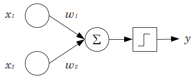

# One-vs-Rest — Simple Perceptron

Neste repositório, realizei a implementação manual daquele que foi o antecessor das redes neurais modernas: o **Perceptron**.

Utilizei conhecimentos teóricos estudados sobre esse algoritmo juntamente com a biblioteca **NumPy**, adotando o paradigma da **Programação Orientada a Objetos**. O objetivo foi criar uma abstração do modelo que pudesse ser ajustada para diferentes necessidades.

## Limitações do Perceptron

Sabemos que a rede Perceptron possui uma limitação importante: ela é **incapaz de aprender padrões de dados não lineares**. Ainda assim, optei por utilizar o **conjunto de dados Iris** devido à sua estrutura relativamente próxima de uma separação linear entre as classes.

## Classificação Multiclasse com One-vs-Rest

O Perceptron é naturalmente um classificador **binário**. Para resolver o problema da **classificação multiclasse** (já que o dataset Iris possui **três classes**: *setosa*, *versicolor* e *virginica*), utilizei a técnica **One-vs-Rest (OvR)**.

Essa técnica é amplamente utilizada para adaptar classificadores binários a tarefas multiclasse. Ela consiste em treinar um modelo para cada classe, distinguindo se a amostra pertence ou não a ela. Por exemplo:

- Um Perceptron determina se a amostra é *setosa* ou não.
- Um Perceptron determina se a amostra é *versicolor* ou não.
- Um Perceptron determina se a amostra é *virginica* ou não.

No entanto, **na prática treinei apenas dois modelos**: um para *setosa* e outro para *virginica*. Isso porque, como temos três classes, podemos inferir que, se a amostra não for *setosa* nem *virginica*, então ela é *versicolor*. Com isso, economizamos tempo e memória.

## Métricas e Visualização

Durante o treinamento, a implementação **armazena as métricas em cada época**:

- Acurácia  
- Precisão  
- Recall  
- F1-Score

Essas métricas são armazenadas para possibilitar **análises gráficas e comparativas do desempenho do modelo** ao longo das épocas.

---

## Funcionamento do Perceptron

Para entender o perceptron, é importante compreender primeiro o conceito de **neurônio artificial**. Nosso cérebro é composto por bilhões de neurônios conectados, e o neurônio artificial é uma **abstração matemática** desses neurônios biológicos. Quando interligados, esses neurônios artificiais formam uma **rede neural**.

### Estrutura do Perceptron

O perceptron funciona da seguinte forma:
1. **Recebe entradas** (valores numéricos dos dados).
2. Cada entrada é **multiplicada por um peso**, que representa a **importância** dessa informação.
3. Soma-se a esse resultado um valor chamado **bias**, que adiciona uma variação ao modelo.
4. O resultado passa por uma **função de ativação**, que decide a saída final do modelo.

> **Função de ativação usada**: função degrau  
> Se o valor for maior que 0, a saída é 1; caso contrário, é 0.

### Parâmetros importantes

- **Pesos**: valores que indicam a importância das entradas.  
- **Bias**: constante adicionada para ajudar na separação dos dados.  
- **Taxa de aprendizado**: define o **ritmo de ajuste dos pesos**.  
  - Valores altos aprendem rápido, mas podem causar **overfitting**.
  - Valores baixos aprendem devagar, mas podem causar **underfitting**.

### Processo de Aprendizado

Durante o treinamento:

- Os pesos são **inicializados com valores pequenos aleatórios**.
- O bias geralmente começa como zero.
- Para cada entrada:
  1. Calcula-se o resultado: `soma(peso * entrada) + bias`
  2. Aplica-se a função de ativação.
  3. Compara-se a saída com o valor esperado.
  4. Calcula-se o **erro**: `erro = valor_esperado - valor_previsto`
  5. **Atualiza-se os pesos**:  
     `novo_peso = peso_antigo + taxa_aprendizado * erro * entrada`
  6. **Atualiza-se o bias**:  
     `novo_bias = bias_antigo + taxa_aprendizado * erro`

Esse ciclo se repete por um número determinado de **épocas** (iterações sobre o conjunto de dados).

---

O perceptron, ao fim do treinamento, utiliza os pesos e o bias aprendidos para realizar previsões em novos dados.
